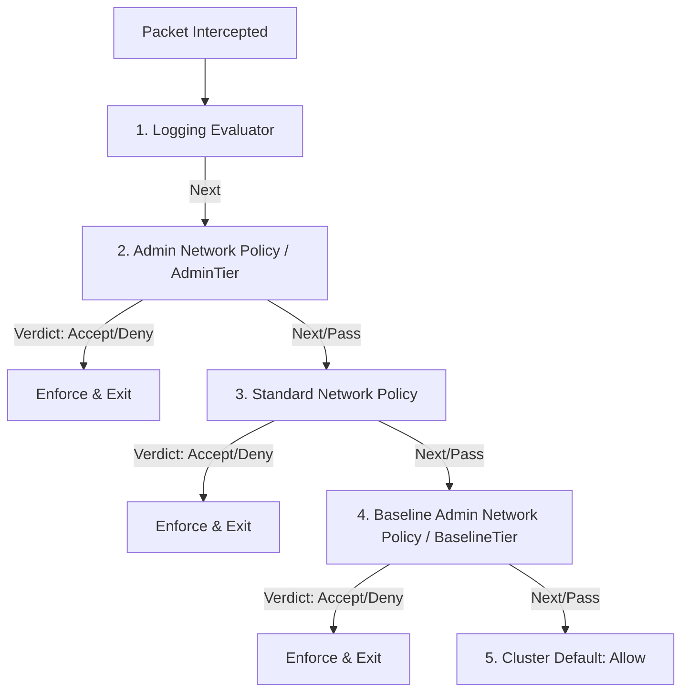
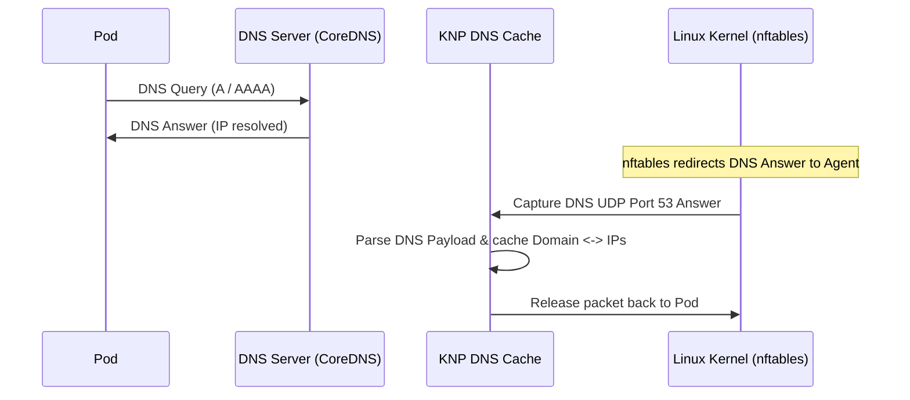

Standard Kubernetes `NetworkPolicies` are namespace-scoped, which allows developers and namespace owners to control traffic inside their applications. However, cluster administrators often need cluster-wide rules to:
- Secure cluster endpoints (e.g., blocking traffic to metadata servers or internal cloud APIs).
- Enforce developer isolation by default.
- Set global baseline defaults that developers can override.

To solve this, `kube-network-policies` integrates with the official [Kubernetes Network Policy API](https://network-policy-api.sigs.k8s.io/) CRDs to support Admin Network Policy (ANP) and Baseline Admin Network Policy (BANP).

---

## API Versions Supported

### v1alpha1
- **CRDs:** `AdminNetworkPolicy` and `BaselineAdminNetworkPolicy` (`policy.networking.k8s.io/v1alpha1`)
- **Plugin:** `plugins/npa-v1alpha1`
- **Binary Variant:** `kube-network-policies-npa-v1alpha1`

### v1alpha2
- **CRD:** `ClusterNetworkPolicy` (`policy.networking.k8s.io/v1alpha2`)
- **Plugin:** `plugins/npa-v1alpha2`
- **Binary Variant:** `kube-network-policies-npa-v1alpha2` (deployed via `install-cnp.yaml`)

Under the hood, both versions are evaluated similarly in the policy pipeline, but v1alpha2 uses a unified `ClusterNetworkPolicy` resource to represent rules at different **Tiers**.

---

## Policy Pipeline Order

When a network packet enters the userspace policy engine, it is processed sequentially by a pipeline of `PolicyEvaluator` plugins. Evaluator priorities determine how rules are enforced:

1. **Logging Evaluator:** If `-v=2` is enabled, this logs the packet details first.
2. **Admin Network Policy (`AdminTier`):** Administrator-defined guardrails. If a rule matches and its action is `Accept` or `Deny`, the packet is immediately resolved and no further policies are checked. If the action is `Pass` (or no rule matches), it goes to the next stage.
3. **Standard Network Policy:** Developer-defined namespace rules. If a policy selects the pod, the standard `NetworkPolicy` logic evaluates it (allowing or denying). If no policy selects the pod, it behaves as `Pass`.
4. **Baseline Admin Network Policy (`BaselineTier`):** Default security postures defined by administrators. These rules are only evaluated if all preceding stages passed.

---

## Traffic Diversion (`divertAll = true`)

In standard mode, `kube-network-policies` optimizes performance by only intercepting packets for pods that are explicitly targeted by at least one active standard `NetworkPolicy` (the agent programs an optimized IP set in `nftables`).

However, when **Admin Network Policies** or **Baseline Admin Network Policies** are enabled, this optimization is disabled, and **all traffic** on the node is diverted to userspace (`divertAll = true`). This is because:
1. Admin policies can target namespaces or pod groups dynamically across the entire cluster.
2. Baseline policies must apply to *all* pods that don't have standard network policies targeting them.

To guarantee correctness, every packet must be evaluated by the userspace agent to check if an Admin or Baseline policy should accept or drop it.

---

## DNS & Domain Name Resolution

Both ANP and CNP allow creating rules that match against external **Domain Names** (e.g. `*.google.com`) instead of hardcoded IP addresses. Since the packet filtering engine works at the IP layers (IPv4/IPv6), the agent needs a way to match IPs to their domain names.

`kube-network-policies` implements this with an in-memory **DNS Domain Cache**:

1. **Packet Redirection:** The agent sets up an `nftables` rule to capture all DNS UDP responses (source port 53) and redirects them to a secondary `nfqueue` (specifically, `nfqueue-id + 1`).
2. **Parsing DNS Answers:** The background `DomainCache` controller parses the captured DNS answer packet, reads the A and AAAA resource records, and stores the resolved IPs and the associated domain name in a radix tree.
3. **TTL Handling:** Cached IP-to-domain associations expire automatically based on the TTL in the DNS answer (subject to a minimum timeout of 30 seconds and a maximum timeout of 300 seconds).
4. **Policy Evaluation:** When a pod attempts to send traffic to an IP, the ANP/CNP egress evaluator queries the `DomainCache` to see if the destination IP matches any allowed domain names before making a verdict.
